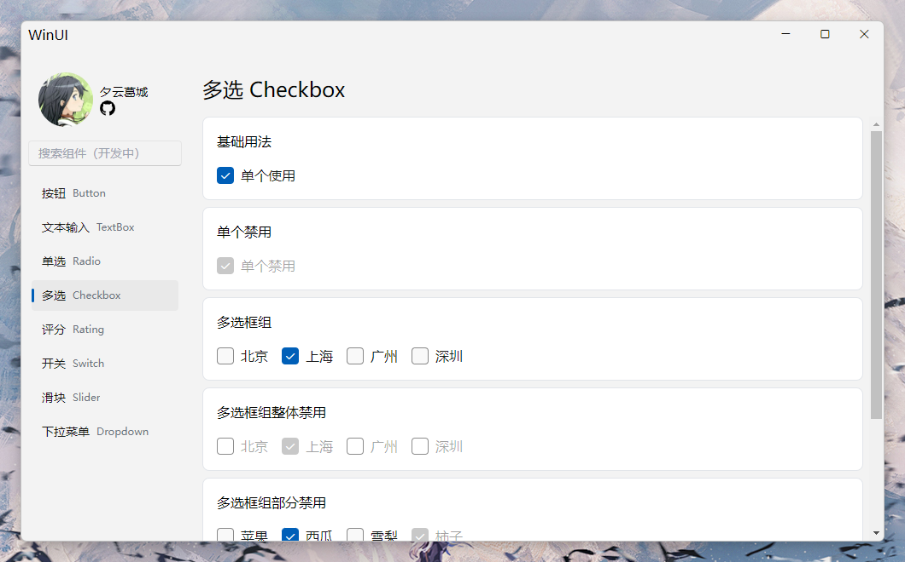

  
  <h1 style="display: block; width: 100%; text-align: center">WinUI-Vue</h1>
  
Windows 11 设计规范的 Vue3 实现

  
  

  <h1>项目环境</h1>
  
  
  
  

  <h1>项目简述</h1>
  <ul>
    <li>当前项目处于开荒阶段，暂无构建版本，也没有 npm 包。</li>
    <li>代码未经优化，API 未定型，因此也暂时没有示例用法。</li>
  </ul>

# 组件计划

- [ ] 按钮
  - [x] 按钮类型
  - [x] 禁用按钮
  - [x] 文字按钮
  - [ ] loading 按钮
  - [ ] icon 按钮
  - [ ] 卡片按钮
- [x] 单选框组
  - [x] 选框组禁用
  - [x] 单个禁用
  - [x] 自定义插槽
- [ ] 多选框组
  - [x] 选框组禁用
  - [x] 单个禁用
  - [ ] 自定义插槽
- [ ] 下拉选择
- [ ] 滑动选择
  - [ ] 常规滑动选择
  - [ ] 任意角度滑动选择
- [ ] 开关
- [ ] 输入框
  - [x] 基本输入组件
  - [ ] 多行输入组件
  - [ ] 前后缀插槽
- [ ] 颜色选择器（进行中）
- [ ] 列表组件
- [ ] 树型列表
- [ ] 导航菜单
  - [x] 垂直导航
  - [ ] 水平导航
- [ ] 标签菜单
- [ ] 表格组件
- [ ] 弹层组件
  - [ ] tooltip
  - [ ] popper
- [ ] 徽章
- [ ] loading
- [ ] 进度条
- [ ] 滚动条
- [ ] alert
- [ ] 右键菜单
- [ ] 文件菜单
- [ ] 画板
- [ ] 面包屑
- [ ] 日期时间组件
- [ ] 头像
- [ ] 媒体播放器
- [ ] Windows 窗口
